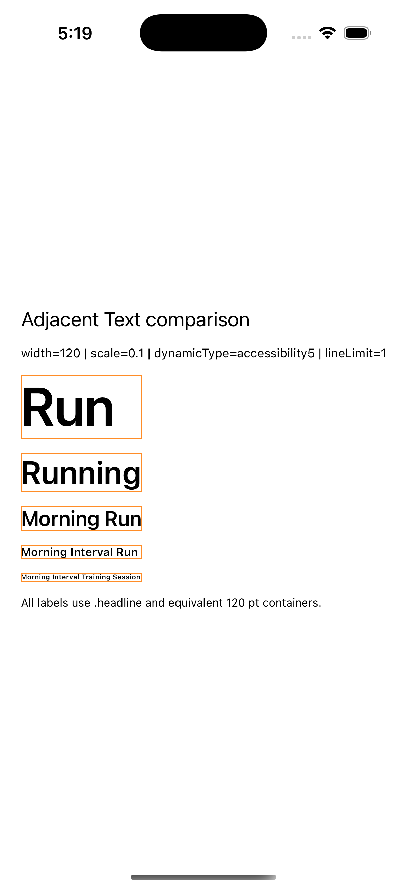
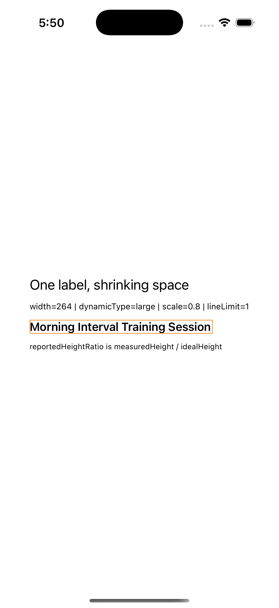

# SwiftUI text scaling lab

A reproducible SwiftUI experiment on `minimumScaleFactor`, Dynamic Type, and
why identical typography can produce very different visual results.

This project grew out of a typography inconsistency I encountered in a
production SwiftUI interface and then reduced to a reproducible case.

**Companion article:** https://salari.dev/writing/what-minimum-scale-factor-trades-away-in-swiftui/

| |
| --- |
|  |

Five labels using the same `.headline`, the same 120 pt container width, the
same Accessibility 5 Dynamic Type environment, and the same
`minimumScaleFactor(0.1)`.

## What this tests

**Adjacent labels.** Do equal `.font(.headline)`, `lineLimit(1)`, container
geometry, Dynamic Type and minimum scale settings guarantee equal reported
layout heights when the strings have different lengths?

**Width threshold.** How does one fixed string respond as horizontal space
changes?

Both experiments record public layout proposals and the sizes `Text` returns.
Neither claims access to SwiftUI's internal rendering algorithm.

## Observed result

| Conditions | Differing measured heights |
| --- | --- |
| 25 with no scaling | 0 of 25 |
| 75 with `minimumScaleFactor` enabled | 75 of 75 |

This is a measurement of reported layout height, not of SwiftUI's internal
glyph scale. The public APIs used here expose layout proposals and
child-reported sizes. They do not expose the scaling factor itself.

## Width threshold

For `.large` with `minimumScaleFactor(0.8)`, measuring
`Morning Interval Training Session`:

| Container width | Measured height | Ideal height |
| ---: | ---: | ---: |
| 200 pt | 16.33 | 20.33 |
| 264 pt | 20.00 | 20.33 |
| 280 pt | 20.33 | 20.33 |
| 400 pt | 20.33 | 20.33 |
| 800 pt | 20.33 | 20.33 |

The measured ideal width was 264.33 pt. The transition zone observed in the
added measurements was 264 to 270 pt.

That figure is empirical for this string, SDK, OS, device and layout. It is
not a documented SwiftUI threshold and should not be treated as one.

| |
| --- |
|  |

## How to reproduce

```bash
git clone https://github.com/salari-dev/swiftui-text-scaling-lab.git
cd swiftui-text-scaling-lab
open TextLayoutResearch.xcodeproj
```

Select the iPhone 17 simulator and run the test target. Measurements are
written to `Evidence/`.

Results will differ on other devices, simulators and SDK versions. The
numbers above hold for the environment below.

## Environment

| | |
| --- | --- |
| Xcode | 26.6 (17F113) |
| Swift | 6.3.3 |
| Simulator SDK | iOS 26.5 |
| Deployment target | iOS 17.0 |
| Device | iPhone 17 Simulator, iOS 26.5 |

## Method

`ProposalProbeLayout` records the incoming proposal, the child proposal, the
finite response, the `.unspecified`, `.zero` and `.infinity` responses, and
the final reported size.

`reportedHeightRatio` is `measuredHeight / idealHeight`. It is not
`fontScale` and it is not `glyphScale`. `actualGlyphScale` is unavailable
through the public APIs used here.

## What this cannot show

This project does not read SwiftUI's internal glyph scale, does not infer its
private text-rendering algorithm, and is not a complete accessibility audit.

None of the behaviour measured here demonstrates a SwiftUI bug. The framework
does what the modifier documents.

## Data

| File | Contents |
| --- | --- |
| [`Evidence/measurements.csv`](Evidence/measurements.csv) | Adjacent labels, 100 conditions, 500 rows |
| [`Evidence/WidthThreshold/measurements.csv`](Evidence/WidthThreshold/measurements.csv) | Width threshold, 220 rows including adaptive widths |
| [`Evidence/WidthThreshold/analysis.md`](Evidence/WidthThreshold/analysis.md) | Threshold analysis |
| [`Evidence/Screenshots/`](Evidence/Screenshots) | Rendered conditions |

## Licence

MIT. See [LICENSE](LICENSE).
